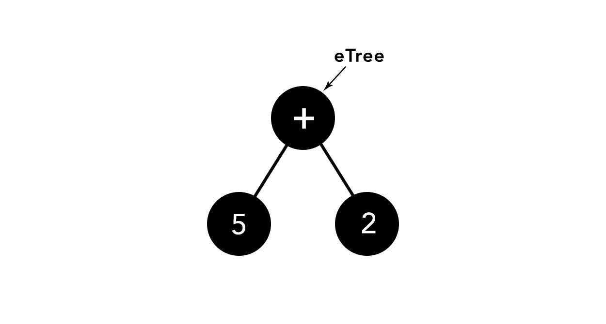
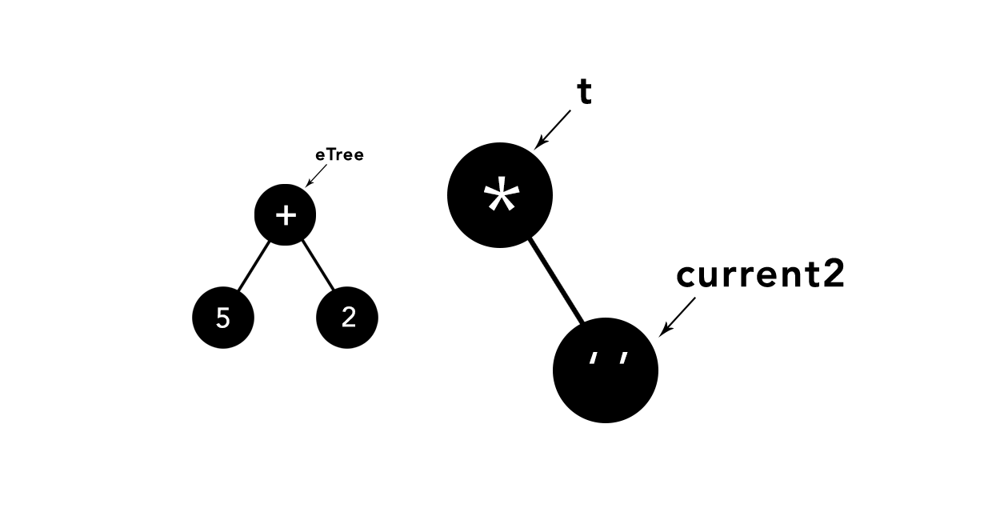
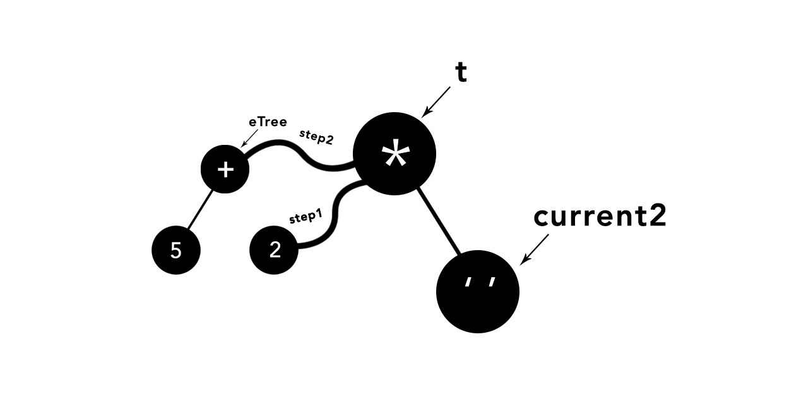
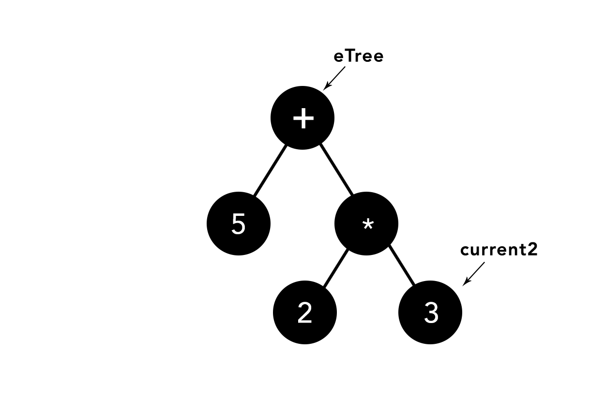
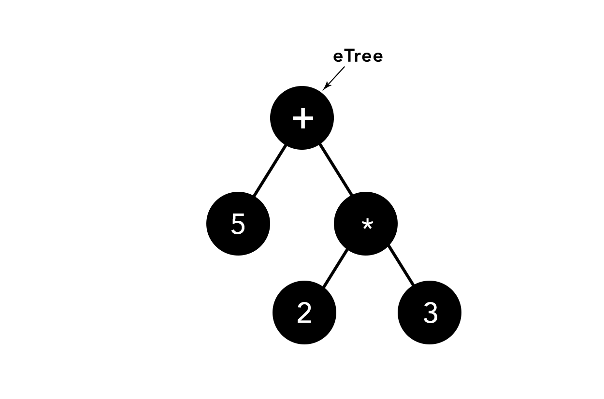
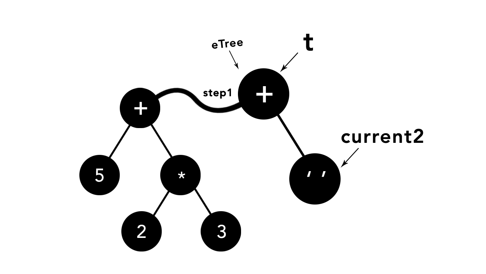
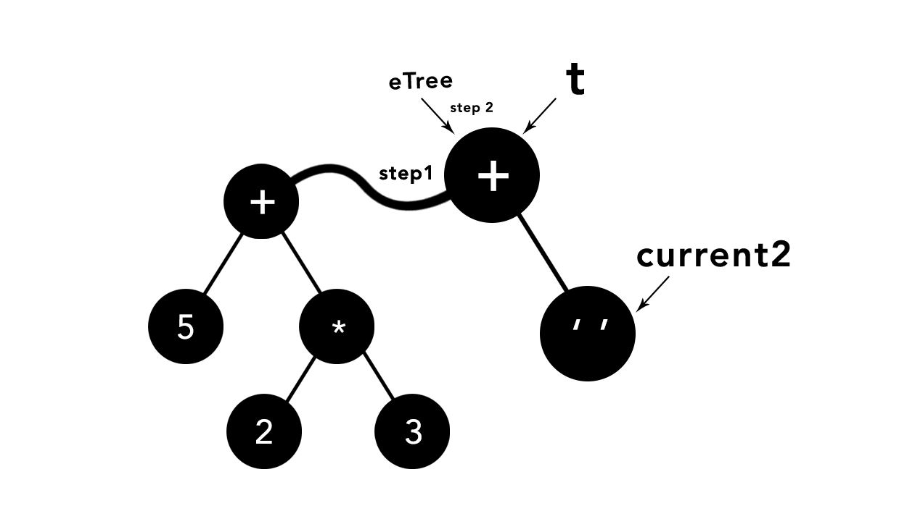
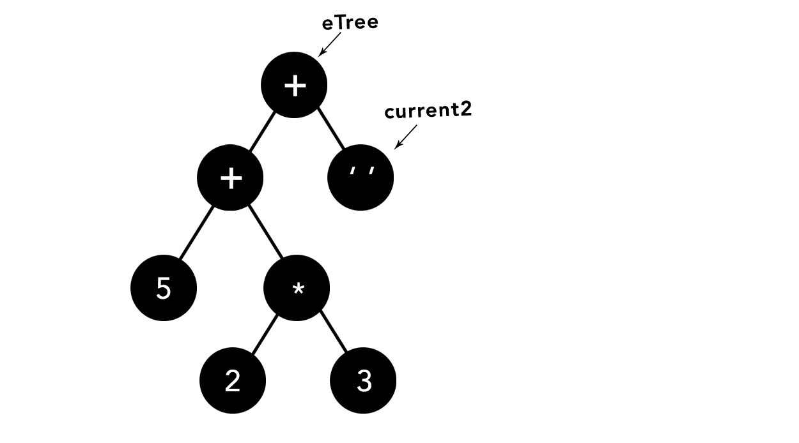
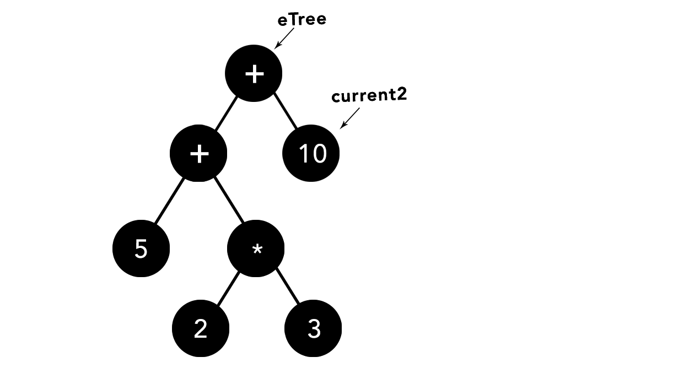
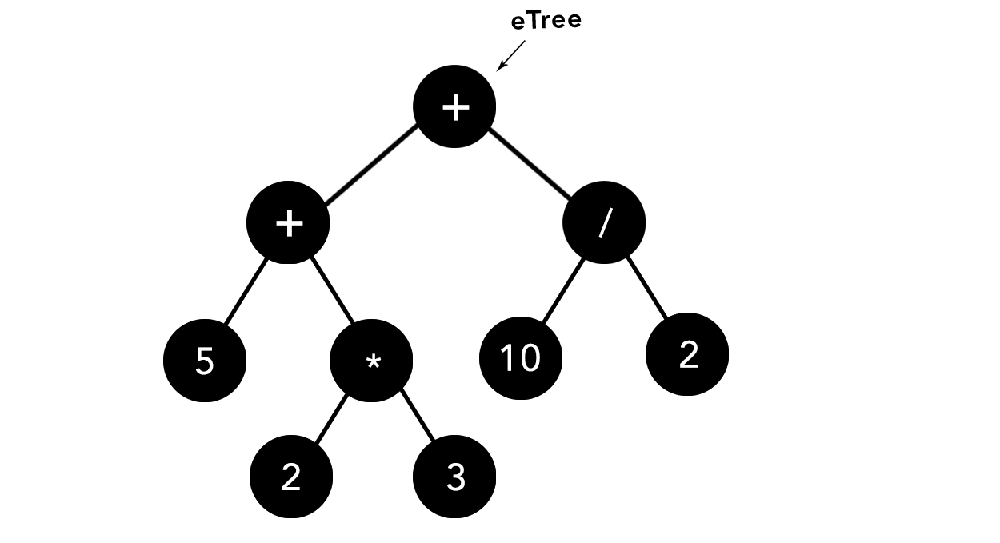

# Uniquely Building Parse Trees
 Building a parse tree from a non-parenthesized mathematical expression, using Python.


# 

## **How it works** 🤔

First, [download](https://www.python.org/downloads/) and install **Python**. Version `3.7` or higher is recommended.


Let's now run the main file, `uniqueParseTrees.py`, no requirements needed, etc.

```bash
python uniqueParseTrees.py
```

That's all you need to know to start!

---

You are now asked to input some non-parenthesized expression as the following

```bash
5 + 2 * 3 + 10 / 2
```

when given such input, the algorithm (implemented in the `buildingUniqueParseTrees` in the `uniqueParseTrees.py` file) is all about splitting the expression into properly ordered sub-expressions.

Then, it starts building its own tree, using the first sub-expression, and so on, looping through the remaining sub-expressions.

### Notice that

The precedence of operators needs to be defined **manually** of course as follows:
```python
operators = {"-": 0, "+": 0, "*": 1, "/": 1}
```

<br>

Here's a quick visual example of what is really happening:

<br>

## starting off by taking the first sub-expression, implementing it manually


## given an operator, we create a temporary tree with the operator as its root value, inserting a right child pointed at by `current2`


## now lets check the precedence
`The operator * has higher precedence than +`



## In such case, we do the following steps:




## we are now left off at this **state**: 


## given an operand, we will store it in the position pointed at by `current2`



## here's the current **state** of our tree:


## given another operator, we create a temporary tree with the operator as its root value, inserting a right child pointed at by `current2`, once again.


## well, this time the operator stored at `t` or the `+` operator, has lower precedence. In such case, we do the following steps: 





## we are now left off at this **state**, once again



## now, given an operand, store it in the position pointed at by `current2`



<br>
<br>

<h2 align="center" style="font-weight: bold;">and so on...</h2>

<br>
<br>

## here's the final state of our uniquely built parse tree:



## and that's about it.

<br>
<br>

## ⚒️ **Built with**

<br>


- [Python](https://www.w3schools.com/python/python_reference.asp) - Python is a popular programming language used in many fields.


<br>


## [License](https://github.com/mostafa-aboelnaga/Terminalio/blob/main/LICENSE)

MIT © [Mostafa Aboelnaga](https://github.com/mostafa-aboelnaga/)
